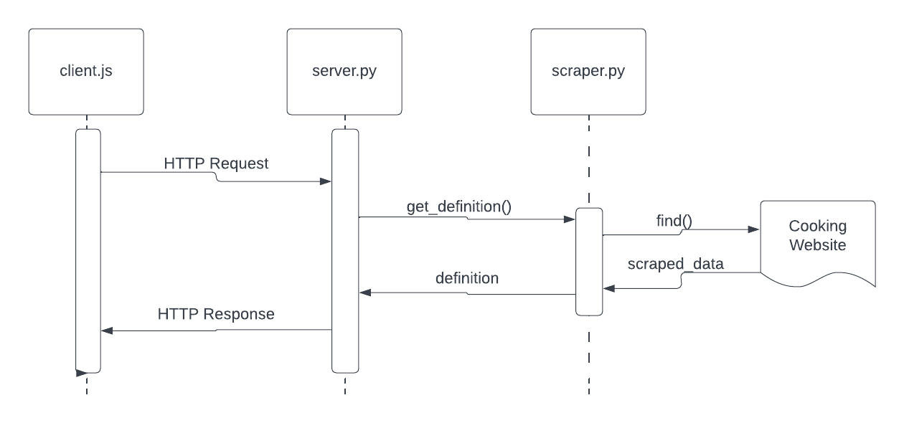

# Overview

Repo houses components of a microservice which provides ingredient definitions to users. Primary components are:
- server.py which receives ingredient names in the form of a string via HTTP request and returns a JSON object containing the ingredient name, definition and, if applicable, a link to learn more.
- scraper.py which is utilized by server.py to scrape a website for the ingredient's definition.
- client.js which is intended to serve as a sample client for connecting with server.py and returning the correct information to the user.

# Communication Contract

## How to Request Data

- Data is requested by sending an HTTP GET request containing a JSON item in the form of item = {'item': ingredient}, where ingredient is the ingredient the user intends to request a definition of.
- Currently, the server.py file and client.js file are configured to run on 6000, locally. Client.js is configured to send the request to 'http://127.0.0.1:6000/' via its function _ingredient_request()_.
- The ingredient in question can be passed to _ingredient_request()_ as a string, the function will create a JSON object itself.

### Example Call 

	sendrequest = request(options = {
		method: 'GET',
		uri: 'http://127.0.0.1:6000/',
		body: {'item': 'bacon'},
		json: true
	};

## How to Receive Data

- The data corresponding to the ingredient in question is sent back to client.js via an HTTP response (again, on port 6000 in current configuration - 'http://127.0.0.1:6000/').
- HTTP response contains a JSON object in the form of {"item": item, "definition": definition, "url": url}.

### Example Response
{
  item: 'Boudin noir',
  definition: 'A blood sauce that is sometimes called “black pudding.”  It is served grilled and usually accompanied with mashed potatoes.',
  url: 'No url'
}

## UML Sequence Diagram

